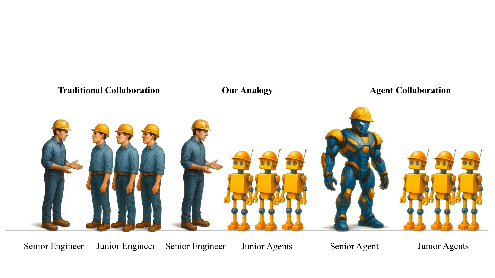
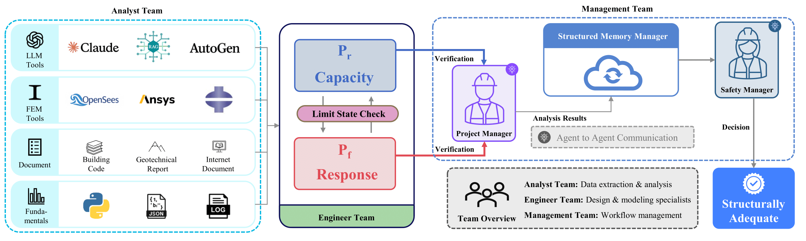
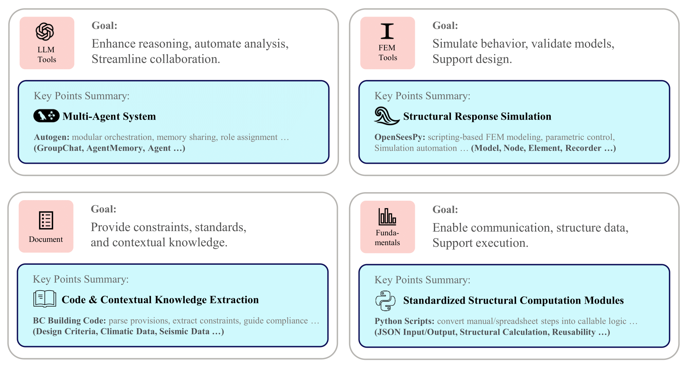
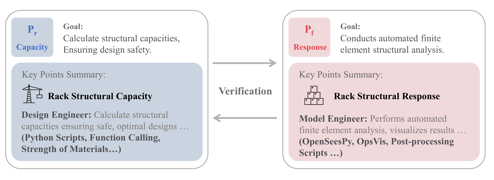
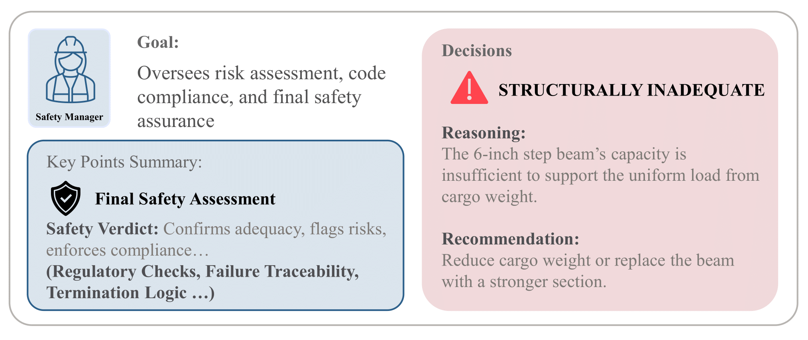
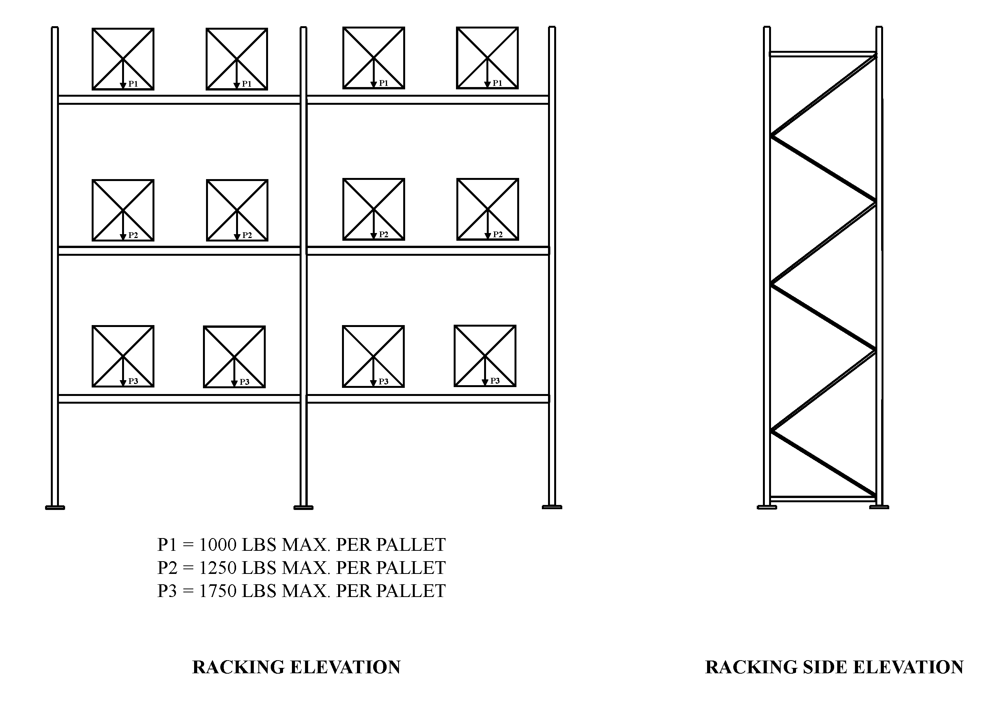
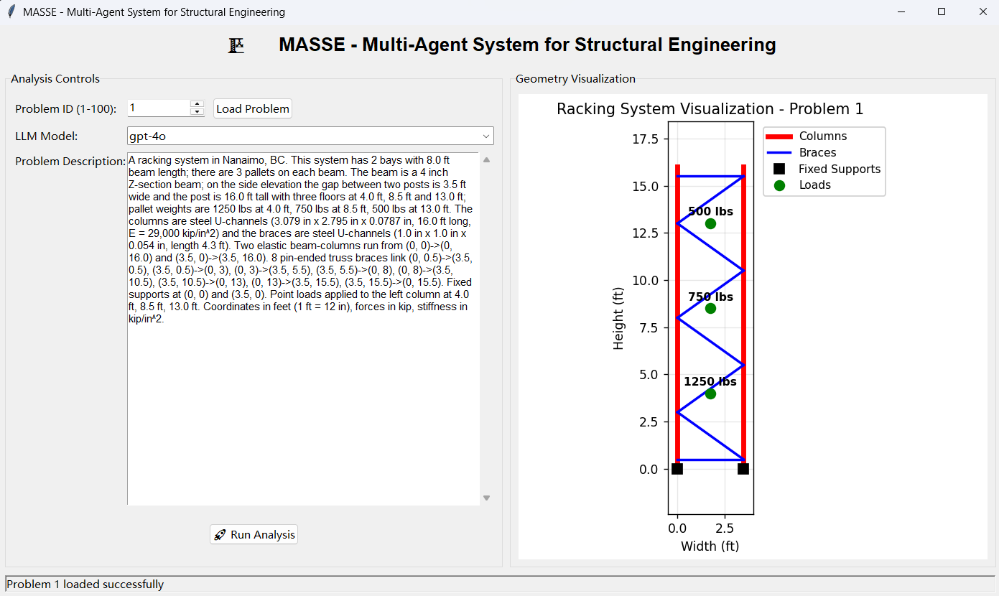

# Automating Structural Engineering Workflows with Large Language Model Agents

[](https://arxiv.org/abs/2510.11004)

## Analogy of future human–AI collaborations

Traditional practice relies on long apprenticeships, with senior engineers transferring expertise to junior engineers through mentorship and problem solving. In contrast, LLM-based multi-agent systems instantiate scalable junior engineer agents that inherit workflows, perform specialized tasks, and coordinate under senior engineers' oversight. As these systems evolve toward self-planning and adaptive learning, fully agentic hierarchies—with senior engineer agent directing junior engineer agents—could transform engineering into a continuously improving, highly efficient practice.



## MASSE Framework

Reflecting this practical organizational model, MASSE introduces three distinct agent teams within a simulated structural engineering consultancy environment: Analyst Team, Engineer Team and Management Team. Each agent is assigned a unique role, goal, and set of constraints, and is further equipped with predefined contexts and specialized tools aligned with these responsibilities. MASSE organizes these agent roles into the following structured teams. More detailed descriptions can be found in the appendices.



> *MASSE* Overall Framework. The **Analyst Team** combines four layers of tools (LLMs, FEM solvers, engineering documents, and fundamentals) to enable multi-agent collaboration. The **Engineer Team** performs limit state verification (Response<Capacity), while the **Project Manager** coordinates workflows and the **Structural Memory** stores analysis data. The **Safety Manager** conducts the final adequacy check. Three specialized teams are shown: **Analyst** (data extraction and analysis), **Engineer** (design and verification), and **Management** (coordination and decision-making).

### Analyst Team

The Analyst Team automates the preparation of structural engineering data by coordinating specialized agents that extract loading conditions, retrieve information from engineering documentation, execute load determination using rule-based methods, and generate structural models. At a high level, this team transforms unstructured project information and regulatory data into standardized engineering inputs, ensuring that subsequent model, design and verification tasks can be carried out with consistency, efficiency, and scalability.



### Engineer Team

The Engineer Team operationalizes the data prepared by the Analyst Team by conducting structural analysis, structural design, and adequacy verification. In broad terms, this team integrates automated simulations and capacity checks to evaluate structural integrity under prescribed loading conditions, enabling systematic, tool-driven assessment of design safety and structural performance.



### Manager Team

The Management Team oversees and coordinates the overall MASSE workflow, transforming analytical outputs from the Analyst Team and Engineer Team into authoritative engineering decisions. Broadly speaking, this team manages task allocation, integrates intermediate results, and issues final structural safety conclusions that guide the entire system. As illustrated in the figure below, the Safety Manager plays a central role within this process by delivering the ultimate adequacy verdict, ensuring that all decisions are consistent with professional safety standards.



## Installation

- **Clone MASSE:**
  ```bash
  git clone https://github.com/yourusername/masse.git
  cd masse
  ```

- **Create a virtual environment in any of your favorite environment managers:**
  ```bash
  conda create -n masse python=3.10
  conda activate masse
  ```

- **Install dependencies:**
  ```bash
  pip install -r requirements.txt
  ```

## Required APIs

You will need the OpenAI API for all the agents (default configuration), and optionally the Anthropic API if you want to use Claude models.

```bash
export OPENAI_API_KEY=$YOUR_OPENAI_API_KEY
export ANTHROPIC_API_KEY=$YOUR_ANTHROPIC_API_KEY
```

Alternatively, you can create a `.env` file in the project root with your API keys:

```bash
# Create .env file
touch .env
# Edit .env with your actual API keys:
# OPENAI_API_KEY=your_openai_api_key_here
# ANTHROPIC_API_KEY=your_anthropic_api_key_here
```

**Note:** The system uses OpenAI's GPT-4o model by default. You can modify the LLM provider settings in `masseagents/default_config.py` to use different models or providers.

## MASSE Package

### Implementation Details

The `MASSE` system is built with `AutoGen` for flexibility and modularity. The framework uses `gpt-4o` as the default LLM model for all agents. For testing purposes, we recommend using `o4-mini` or `gpt-3.5-turbo` to save costs, as the framework makes many API calls during the multi-agent workflow.

### Python Usage

You can use `MASSE` within your Python code by importing the `masseagents` module and initializing a `StructuralAnalysisWorkflow()` object. The `.run_full_analysis()` function returns the analysis results. Alternatively, you can run `main.py` to use the graphical interface.

**Basic Usage:**

```python
from masseagents.workflows.structural_workflow import StructuralAnalysisWorkflow
from masseagents.default_config import get_default_config

# Initialize workflow with default configuration
config = get_default_config()
workflow = StructuralAnalysisWorkflow(config)

# Run analysis
problem_description = "A racking system in Nanaimo, BC. This system has 2 bays with 8.0 ft beam length; there are 3 pallets on each beam. The beam is a 4 inch Z-section beam; on the side elevation the gap between two posts is 3.5 ft wide and the post is 16.0 ft tall with three floors at 4.0 ft, 8.5 ft and 13.0 ft; pallet weights are 1250 lbs at 4.0 ft, 750 lbs at 8.5 ft, 500 lbs at 13.0 ft. The columns are steel U-channels (3.079 in x 2.795 in x 0.0787 in, 16.0 ft long, E = 29,000 kip/in^2) and the braces are steel U-channels (1.0 in x 1.0 in x 0.054 in, length 4.3 ft). Two elastic beam-columns run from (0, 0)->(0, 16.0) and (3.5, 0)->(3.5, 16.0). 8 pin-ended truss braces link (0, 0.5)->(3.5, 0.5), (3.5, 0.5)->(0, 3), (0, 3)->(3.5, 5.5), (3.5, 5.5)->(0, 8), (0, 8)->(3.5, 10.5), (3.5, 10.5)->(0, 13), (0, 13)->(3.5, 15.5), (3.5, 15.5)->(0, 15.5). Fixed supports at (0, 0) and (3.5, 0). Point loads applied to the left column at 4.0 ft, 8.5 ft, 13.0 ft. Coordinates in feet (1 ft = 12 in), forces in kip, stiffness in kip/in^2."
result = workflow.run_full_analysis(problem_description, location="Nanaimo, BC", problem_id="1")

# Access results
print(f"Final Result: {result['final_result']}")
print(f"Safety Status: {result['safety_status']}")
```

The default configuration can be adjusted for LLMs, temperature, max rounds, etc.

**Custom Configuration:**

```python
from masseagents.workflows.structural_workflow import StructuralAnalysisWorkflow
from masseagents.default_config import get_default_config

# Create custom configuration
config = get_default_config()
config["llm_model"] = "claude-3-5-sonnet-latest"  # Use a different model
config["temperature"] = 0  # Set temperature
config["max_round"] = 10  # Increase max rounds
config["max_tokens"] = 4000  # Adjust max tokens

# Initialize workflow with custom config
workflow = StructuralAnalysisWorkflow(config, log_dir="logs/custom_analysis")

# Run analysis
result = workflow.run_full_analysis(
    problem_description="A racking system in Nanaimo, BC. This system has 2 bays with 8.0 ft beam length; there are 3 pallets on each beam. The beam is a 4 inch Z-section beam; on the side elevation the gap between two posts is 3.5 ft wide and the post is 16.0 ft tall with three floors at 4.0 ft, 8.5 ft and 13.0 ft; pallet weights are 1250 lbs at 4.0 ft, 750 lbs at 8.5 ft, 500 lbs at 13.0 ft. The columns are steel U-channels (3.079 in x 2.795 in x 0.0787 in, 16.0 ft long, E = 29,000 kip/in^2) and the braces are steel U-channels (1.0 in x 1.0 in x 0.054 in, length 4.3 ft). Two elastic beam-columns run from (0, 0)->(0, 16.0) and (3.5, 0)->(3.5, 16.0). 8 pin-ended truss braces link (0, 0.5)->(3.5, 0.5), (3.5, 0.5)->(0, 3), (0, 3)->(3.5, 5.5), (3.5, 5.5)->(0, 8), (0, 8)->(3.5, 10.5), (3.5, 10.5)->(0, 13), (0, 13)->(3.5, 15.5), (3.5, 15.5)->(0, 15.5). Fixed supports at (0, 0) and (3.5, 0). Point loads applied to the left column at 4.0 ft, 8.5 ft, 13.0 ft. Coordinates in feet (1 ft = 12 in), forces in kip, stiffness in kip/in^2.",
    location="Nanaimo, BC",
    problem_id="1"
)
```

The default configuration uses OpenAI's GPT-4o model. You can modify the LLM provider settings in `masseagents/default_config.py` to use different models (OpenAI or Anthropic) or adjust other system parameters. The full list of configurations can be viewed in `masseagents/default_config.py`.

## Running an Example

This section demonstrates how to use MASSE to analyze a structural engineering problem. We will solve a racking system design problem to illustrate the workflow.

### Problem Description

We aim to analyze a racking system located in Nanaimo, BC. The problem description is as follows:

> A racking system in Nanaimo, BC. This system has 2 bays with 8.0 ft beam length; there are 3 pallets on each beam. The beam is a 4 inch Z-section beam; on the side elevation the gap between two posts is 3.5 ft wide and the post is 16.0 ft tall with three floors at 4.0 ft, 8.5 ft and 13.0 ft; pallet weights are 1250 lbs at 4.0 ft, 750 lbs at 8.5 ft, 500 lbs at 13.0 ft. The columns are steel U-channels (3.079 in x 2.795 in x 0.0787 in, 16.0 ft long, E = 29,000 kip/in^2) and the braces are steel U-channels (1.0 in x 1.0 in x 0.054 in, length 4.3 ft). Two elastic beam-columns run from (0, 0)->(0, 16.0) and (3.5, 0)->(3.5, 16.0). 8 pin-ended truss braces link (0, 0.5)->(3.5, 0.5), (3.5, 0.5)->(0, 3), (0, 3)->(3.5, 5.5), (3.5, 5.5)->(0, 8), (0, 8)->(3.5, 10.5), (3.5, 10.5)->(0, 13), (0, 13)->(3.5, 15.5), (3.5, 15.5)->(0, 15.5). Fixed supports at (0, 0) and (3.5, 0). Point loads applied to the left column at 4.0 ft, 8.5 ft, 13.0 ft. Coordinates in feet (1 ft = 12 in), forces in kip, stiffness in kip/in^2.



The goal is to determine whether this racking system is structurally adequate under the specified loading conditions, following Canadian building code requirements for seismic analysis in Nanaimo, BC.

### Using the Graphical Interface

MASSE provides a user-friendly graphical interface for running structural analyses. Launch the interface by running:

```bash
python main.py
```



The interface consists of several key components:

- **Left Panel - Analysis Controls:**
  - **Problem ID**: Select or enter a problem ID (1-100) from the dataset
  - **LLM Model**: Choose the language model to use (e.g., `gpt-4o`, `claude-3-5-sonnet-latest`, `o4-mini`)
  - **Problem Description**: Displays the loaded problem description in a scrollable text area
  - **Run Analysis Button**: Initiates the multi-agent analysis workflow

- **Right Panel - Geometry Visualization:**
  - Displays a visual representation of the structural system
  - Shows columns (in red), braces (in blue), supports, and applied loads
  - Updates automatically when a problem is loaded

- **Status Bar**: Shows the current status of the analysis (e.g., "Ready", "Running analysis...", "Analysis completed")

To run the example:

1. Launch the interface using `python main.py`
2. Enter or select the problem ID corresponding to the racking system
3. Click "Load Problem" to load the problem description and visualize the geometry
4. Select your preferred LLM model
5. Click "🚀 Run Analysis" to start the multi-agent workflow
6. Wait for the analysis to complete (the system will coordinate multiple specialized agents)
7. Review the results, which are saved in `logs/<model_name>/problem_<id>/`

The analysis results include detailed information about building parameters, seismic loads, structural model, internal forces, and the final safety assessment.

## Contributing

We welcome contributions from the community! Whether it's fixing a bug, improving documentation, or suggesting a new feature, your input helps make this project better. We welcome collaboration from both industry and academy. If you are interested in this line of research, please contact me at [hliang7@ualberta.ca](mailto:hliang7@ualberta.ca) ([Google Scholar](https://scholar.google.com/citations?user=0z0KKtsAAAAJ&hl=en)) or the head of lab Dr. Qipei (Gavin) Mei at [qipei.mei@ualberta.ca](mailto:qipei.mei@ualberta.ca) ([Google Scholar](https://scholar.google.com/citations?user=06VJSBgAAAAJ&hl=en)).

## Disclaimer

- **Research and Educational Purpose Only.**  
  The multi-agent system, methods, code, and data described in this repository are developed solely for academic research and educational use. They are not intended, nor should they be relied upon, for direct application in real-world engineering design, construction, or deployment. The authors, their institutions, and any collaborators explicitly disclaim all liability for any consequences, including but not limited to structural deficiencies, under-design, damages, or failures, arising from the use, misuse, or adaptation of the methods, parameters, or formulas presented herein. Any attempt to implement or deploy the system in practice is done entirely at the user's own risk and responsibility.

- **Human Evaluation.**  
  All human evaluation conducted in this study was performed exclusively for the purpose of benchmarking and comparative analysis. Data generated by participants is kept strictly confidential, used only within the scope of this research, and will not be applied to any commercial, industrial, or real-world engineering activities.

- **Privacy and Data Protection.**  
  The dataset employed in this work is derived from production records within structural engineering consultancy practice but has been anonymized, cleaned, and used strictly for academic research. No identifying information, proprietary designs, or sensitive client data are disclosed. All outputs generated by the multi-agent system remain confined to research purposes and will not be released, applied, or repurposed for operational engineering, deployment, or commercial use. This research adheres to applicable data privacy principles and safeguards the rights and interests of all parties involved.

## Citation

If you use this work in your research, please cite:

```bibtex
@article{liang2025automating,
  title={Automating Structural Engineering Workflows with Large Language Model Agents},
  author={Liang, Haoran and Zhou, Yufa and Kalaleh, Mohammad Talebi and Mei, Qipei},
  journal={arXiv preprint arXiv:2510.11004},
  year={2025}
}
```
